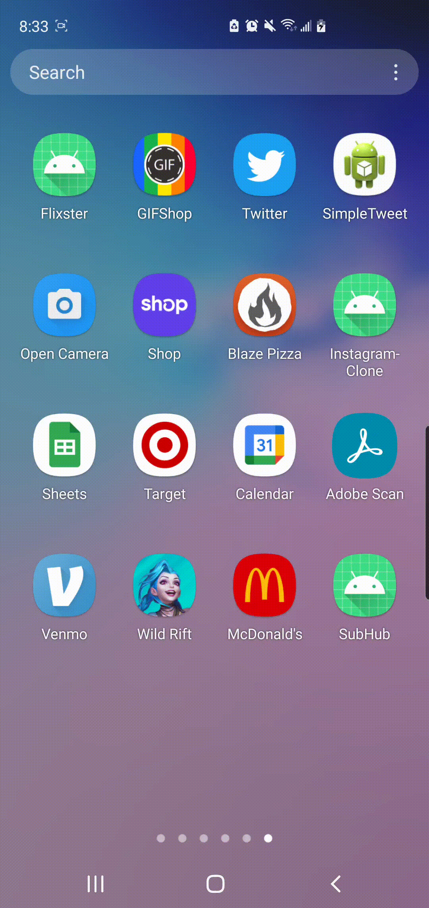

Original App Design Project - README Template
===

# SubHub

## Table of Contents
1. [Overview](#Overview)
1. [Product Spec](#Product-Spec)
1. [Wireframes](#Wireframes)
2. [Schema](#Schema)

## Overview
### Description
An app that allow users to watch Youtube livestream, login, create profile in a user friendly UI for mobile.
### App Evaluation
[Evaluation of your app across the following attributes]
- **Category: Entertainment/Social Media**
- **Mobile: This app would be for Mobile since Youtube live is aready on websites.**
- **Story: Let user to have a stream hub similar to twitch.tv but for youtube. It would be a streamline design and simple interface as well as more accurate because of its specific streaming focus compared to Youtube who's infrastructure is so huge and easy to get lost in.**
- **Market: Depending on the content of livestream there may be a age restriction, app is made for teens aged 13 and up. Our market is the entirety of the youtube viewerbase but more specifically targeted at youtube streaming. If it does well, it could also draw in users that haven't been on youtube as well if they mainly focus on streamers rather than watching videos.**
- **Habit: This app can be used as often as user want. Our app engagement would depend on how avid of a stream watcher the user is which can range from someone checking in on a streamer that streams once in a while or someone who watches multiple streams throughout a day everyday and needs/wants an area where it is organized for them with notifications, etc.**
- **Scope: First we would like to make the mobile user friendly, then we will like to filter different livesteam by games, events age etc.**

## Product Spec

### 1. User Stories (Required and Optional)

**Required Must-have Stories**

* [x] Navigation tab. 
* [x] Login screen.
* [ ] List Viewer of different livestreams.
* [ ] A search feature for livestreams and possibly channels.
* [ ] An ADD stream/follow button.
* [ ] sign in with youtube/google services.
* [ ] sync up with youtube/google services.
* [ ] Opens the youtube app or the corresponding link to the stream in your browser.


**Optional Nice-to-have Stories**

* [ ] Create a profile page/customize 
* [ ] different "hubs" where user can designate their own groups of youtubers/streamers to watch (ex: i create a tab for specifically minecraft streamers that i follow, etc)
* [ ] notifications on/off option for tabs/streamers 
* [ ] Ability to watch the stream on the app itself if possible.
* [ ] Tab of top streamers if the Youtube API allows for it. 
* [ ] Recommendations of different livestreams based on who you follow. 

### 2. Screen Archetypes

* Login to Youtube
   * Register - User signs up or logs into their account
* List of Views
   * 2x1 view of livestreams
* Search bar
   * search and filter new live streams as well as channels
### 3. Navigation

**Tab Navigation** (Tab to Screen)

* View Streams
* View Profile
* Search 

**Flow Navigation** (Screen to Screen)
* Forced Log-in -> Account creation if no log in is available
* Stream Selection  -> Jumps to a list of Livestream if not go to search 
* Search -> Jump to searchbar 


## Wireframes


### [BONUS] Digital Wireframes & Mockups


### [BONUS] Interactive Prototype

## Schema 
[This section will be completed in Unit 9]
### Models
Property                | Type     | Description
-----------             |----------|------------
snippet.thumbnails.(key)| object   | Default thumbnail image
client_id               | string   | OAuth client ID application
redirect_uri            |          | Redirects user from Oauth to the app
response_type           | boolean  | Determines whether the Google OAuth 2.0 endpoint returns an authorization code.
scope                   | list     | A space-delimited list of scopes that identify resources on thhe application.
state                   | string   | Maintains the state of the application for debugging the permissions
### Networking
List of network requests by screen
- Login Screen
  - (GET) User login/sign up 
  
- private void loginUser(String username, String password) {
  - ParseUser.logInInBackground(username, password, new LogInCallback(){
       -@Override
        -public void done(ParseUser user, ParseException e) {
           -if(e!=null){
         -Toast.makeText(LoginActivity.this , "Issue with login",Toast.LENGTH_SHORT).show();
                -return;

- Main Screen
  - (GET) Youtube url
  - (DELETE) Delete a channel from your list 
  - (ADD) Add a channel to your list 
```swift
  ParseQuery<ParseObject> query = ParseQuery.getQuery("ChannelList");
  query.getInBackground("j3GZKCpqN2", new GetCallback<ParseObject>() {
    public void done(ParseObject channels, ParseException e) {
    if (e == null) {
      channels.put("channel", “https://www.youtube.com/channel/UC5iC25Jaeo6OGZB60Xsr7sQ”);
      channels.put(“favorites”, https://www.youtube.com/channel/UC5iC25Jaeo6OGZB60Xsr7sQ);
      channels.saveInBackground();
    }
  }
});
```
- Profile Screen
  - (Read/GET) Query logged in user object
  - (Update/PUT) Update user profile image

#### [OPTIONAL:] Existing API Endpoints
##### Youtube Data API
- Base URL - [https://www.googleapis.com/youtube/v3](https://www.googleapis.com/youtube/v3)

   HTTP Verb | Endpoint | Description
   ----------|----------|------------
    `GET`    | /channels?part=contentDetails&channelId={channelId} | Get all details of a channel according to id
    `GET`    | /channels?part=contentDetails&channelId={channelId1, channelId2, etc} | Return json object with list of channels according to id
    `GET`    | /search?part=snippet&q={search keyword}&type=channel&key={API_KEY} | Returns search results in the form of snippets for channels that contain the search keyword (ex: pokemon)
    `GET`    | /search?part=snippet&q={search keyword}&type=video&key={API_KEY} | Returns search results in the form of snippets for videos that contain the search keyword
    
## Build Progress 

